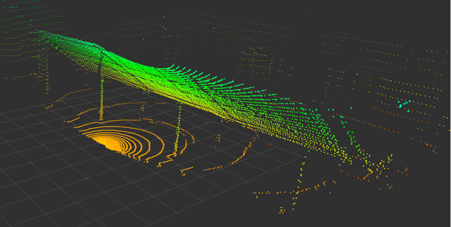
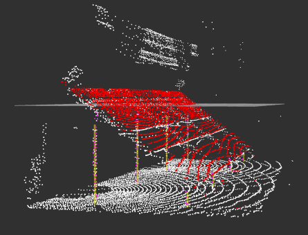
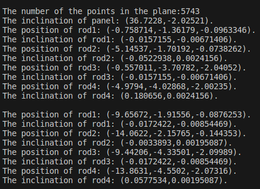

# Perception

A ROS-based perception system for processing multi-LiDAR data.

## System Overview

### 1. Original Scene


### 2. Point Cloud Detection


### 3. Custom Message Visualization


## Prerequisites

### Dependencies

1. **yaml-cpp**
```bash
sudo apt update
sudo apt install libyaml-cpp-dev
```

2. **GeographicLib**
```bash
git clone https://github.com/geographiclib/geographiclib
cd geographiclib
mkdir build && cd build
cmake ..
make
sudo make install
```

## Project Setup

### 1. Create Workspace
```bash
mkdir -p workspace/src
cd workspace
catkin_make  # If error occurs by conda environment, try: catkin_make -DPYTHON_EXECUTABLE=/usr/bin/python3
```

### 2. Get Source Code
Clone the project under workspace/src directory:
```bash
git clone ssh://git@star-center.shanghaitech.edu.cn:10022/bolight-mars/perception.git
```

### 3. Data Preparation
1. Download the dataset from seafile website: `Bolight/3lidars_stands.bag`
2. Configuration file modifications:
   - Update bag file path in `perception/launch/action.launch`
   - Modify model file path in `perception/config/file_config.yaml`:
     ```yaml
     file_path: /path/to/workspace/src/perception/data/stands_model_pc.pcd
     ```

## Running the Program

Execute in the workspace directory:
```bash
catkin_make
source ./devel/setup.bash
roslaunch perception action.launch
```

### Important Notes
- To run the Perception module as an Action Server, comment out the action_client related code in `action.launch`
- Ensure all file paths are correctly configured before running the program
